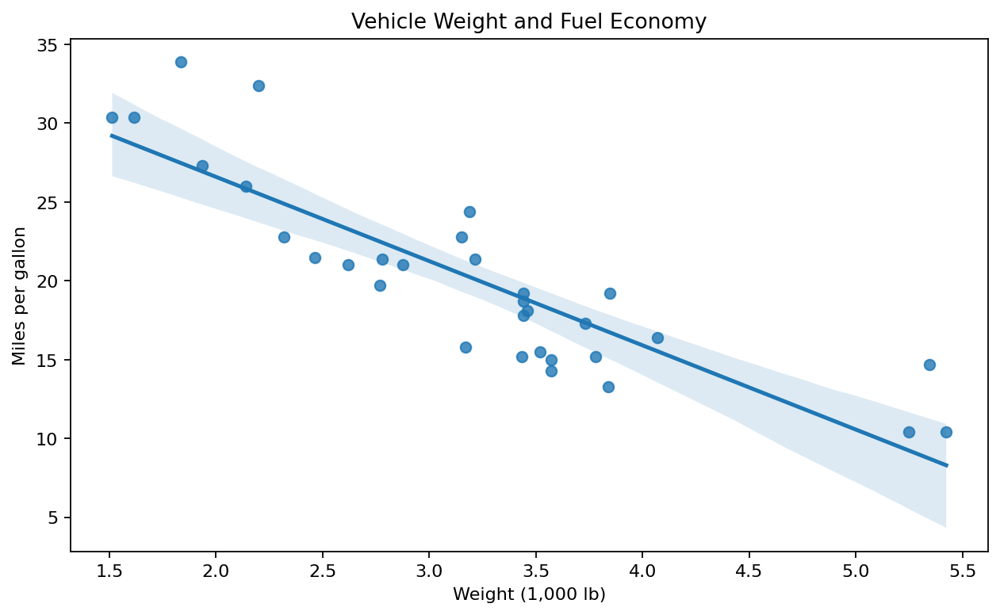

# MTCars Exploratory Analysis

## Objective

Explore fuel economy and vehicle characteristics using descriptive statistics and visualization. The analysis examines transmission, weight, cylinders, horsepower, displacement, and rear-axle ratio.

## Analyst approach

- Compare MPG distributions by transmission and cylinder count
- Examine the association between vehicle weight and MPG
- Review correlations among numeric variables
- Separate descriptive evidence from causal claims

## Verified descriptive results

- Automatic median MPG: **17.3**
- Manual median MPG: **22.8**
- Manual vehicles are approximately **1,358 lb lighter on average** in this sample
- Toyota Corolla: **1,835 lb** and **33.9 MPG**
- Lincoln Continental: **5,424 lb** and **10.4 MPG**

## Files

- `notebooks/MTCars_Exploratory_Analysis.ipynb` — executed notebook with visible outputs
- `data/mtcars.csv` — local source data
- `images/` — exported charts

## Preview

## Limitation

MTCars contains only 32 observations and is observational. Relationships such as lower weight being associated with higher MPG do not prove causation and may reflect confounding vehicle-design differences.
