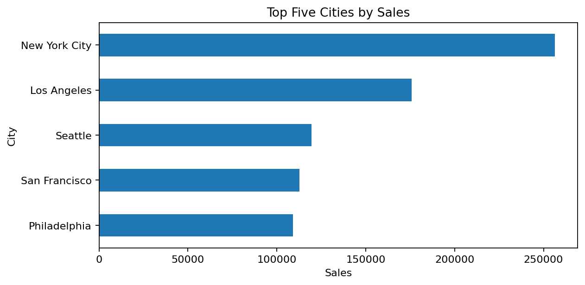

# Superstore Business Performance

## Business objective

Evaluate sales, profit, product concentration, shipping performance, customer purchasing behavior, geographic performance, and order returns to support retail decision-making.

## Analyst questions

- What are total sales, profit, margin, and returned-order rate?
- Which cities and product categories drive performance?
- How concentrated are sales across products?
- Does shipping duration worsen in the fourth quarter?
- Which customers have unusually high returned-order rates?
- How long does it take customers to place a second order?

## Data quality and metric design

The table contains **9,994 order-line rows** and **5,009 unique orders**. Return status is order-level, so returned-order rate uses unique `Order ID` values rather than line rows. `Row ID` remains unique, preventing duplicated sales or profit.

## Verified highlights

- Sales: approximately **$2.30 million**
- Profit: approximately **$286.4 thousand**
- Profit margin: approximately **12.47%**
- Returned orders: **296**
- Returned-order rate: approximately **5.91%**
- Products needed to reach 80% of sales: approximately **22.23%**

## Files

- `notebooks/Superstore_Business_Performance.ipynb` — executed analysis with visible outputs
- `data/superstore_analysis_data.csv` — validated analytical table
- `images/` — exported charts
- `src/superstore.py` — reusable validation and KPI functions
- `tests/` — five automated grain and data-quality checks
- `docs/DATA_GRAIN_AND_METRICS.md` — metric definitions and denominators

## Preview

## Limitations

The raw Orders and Returns workbook is not included in this repository. The supplied CSV is internally validated, but the repository does not claim to reproduce the original raw-data transformation from source.
