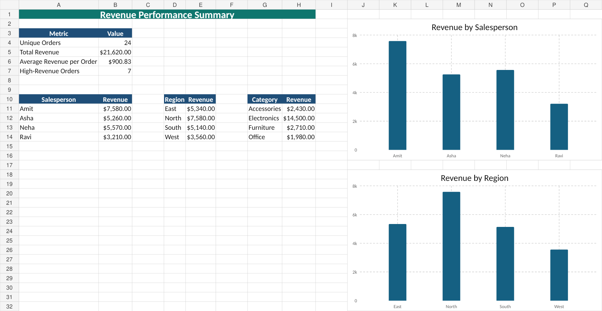

# Dealmakers Deep Dive

## Objective

Analyze sales revenue by salesperson, region, category, and product using spreadsheet formulas, conditional formatting, structured summaries, and charts.

## Data-quality correction

The supplied source contained one exact duplicate for order `O1024`. The clean workbook removes that duplicate, reducing the dataset from 25 rows to 24 unique orders and adjusting total revenue from $23,240 to **$21,620**.

## Verified highlights

- Highest salesperson revenue: **Amit — $7,580**
- Highest region revenue: **North — $7,580**
- Highest category revenue: **Electronics — $14,500**

## Files

- `workbook/Dealmakers_Deep_Dive.xlsx`
- `images/dealmakers_summary_preview.png`

## Preview

## Limitation

The dataset is small and educational; findings demonstrate spreadsheet-analysis technique rather than a production sales forecast.
