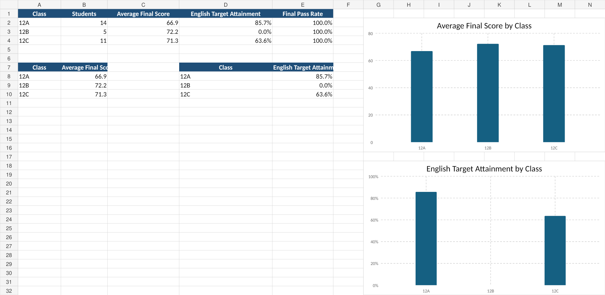

# Scholar Insights Engine

## Objective

Analyze student performance across classes, subjects, and exams using formula-driven spreadsheet logic and visual summaries.

## Corrections applied

- Pass/Fail is based on **Score**, not Term.
- Target comparison uses both **Class and Subject**.
- The workbook avoids full-column dynamic formulas that made the original export unnecessarily large.

## Workbook contents

- `Students` — student master data
- `Exams` — exam metadata
- `Scores` — 300 score records with Pass/Fail, class, target, and target-status formulas
- `Targets` — class-and-subject targets
- `Student Summary` — final averages, pass rates, English target status, and best final subject
- `Class Summary` — class-level averages and target attainment

## Files

- `workbook/Scholar_Insights_Engine.xlsx`
- `images/scholar_summary_preview.png`

## Preview

## Limitation

The file is an Excel-compatible portfolio export. Upload it to Google Sheets for a live Google Sheets version and verify formulas after conversion.
